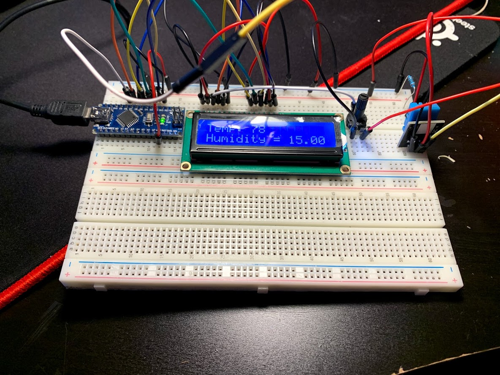

# DHT11 to LCD
This arduino program outputs the DHT11 sensor readings to the Arduino. I personally used this on the Arduino Nano, but it was also tested on the Arduino Mega and the Arduino Uno. 
### Libraries Required

 1. Adafruit DHT11 Library ([Here](https://github.com/adafruit/DHT-sensor-library))
 2. Adafruit Sensor Library ([Here](https://github.com/adafruit/Adafruit_Sensor))
 3. LiquidCrystal Library, already included in the Arduino IDE.
### Photo and what to hook up

Hook up the DHT11 sensor data pin to digital pin 8 on the arduino.
Hook up the LCD from right to left on 2 - 7.

### Contact
If you have any questions or need help, email me over at alex@napend.com